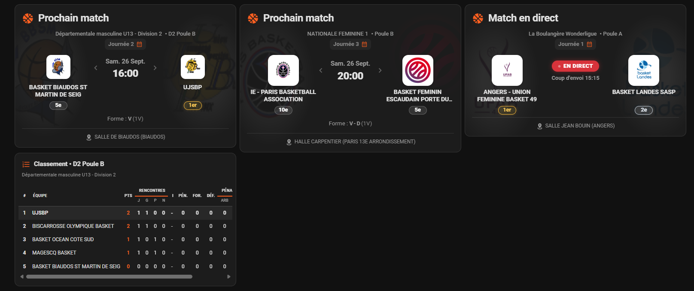

 

# 📸 Screenshots

A quick tour of what the card looks like in different configurations. Back to the [main README](../README.md).

## Current examples

  

> ⚠️ This screenshot predates a few visual tweaks and isn't fully up to date: calendar-row crests are now bigger (22px, were 16px), team names in the standings tables no longer truncate, standings rows now show a small team crest too, and calendar rows are a bit more compact. A refreshed screenshot is welcome (see below).

From left to right:

* **Upcoming match** (`display_mode: match`, the default) -- team crests, clickable round/journée badge, recent form streak, and venue with a Google Maps link.
* **Upcoming match, a different pool** -- same layout, with a longer opponent name truncated to fit.
* **Live match** -- once the match has started, the countdown is replaced by the red "Live" badge and the kickoff time.
* **Standings** (`display_mode: standings`, bottom-left card) -- the full pool table, with your own team highlighted, a small crest per row, and horizontal scroll on narrow screens.

## Coming soon

A few configurations aren't illustrated here yet:

* `display_mode: both` (match card + standings card stacked in the same entry)
* `logo_size: extra_large`
* `rank_badge_style` variants (`solid` / `none`)
* The English UI (all current screenshots are in French)
* An up-to-date gallery screenshot (see the warning above)

Have a screenshot for one of these? Open a PR or an issue with the image and the `display_mode` / `logo_size` used to produce it, and it'll be added here.
